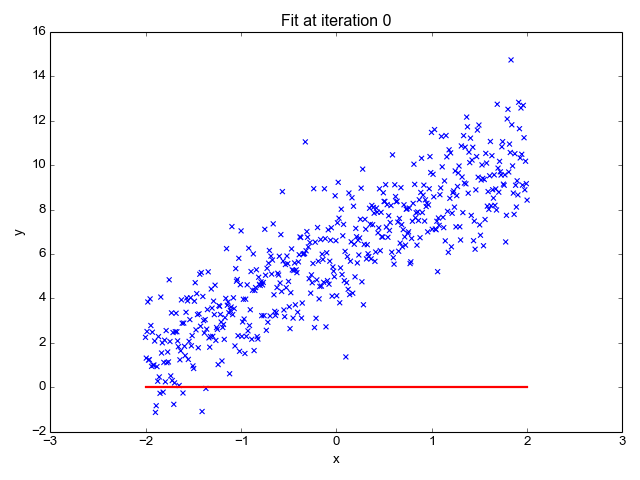

# YOLO:

You only look once

# Hough-Transformation:
The [Hough transformation](https://homepages.inf.ed.ac.uk/rbf/HIPR2/hough.htm) is a technique which can be used to isolate features of a particular shape within an image. Because it requires that the desired features be specified in some parametric form, the *classical* Hough transform is most commonly used for the detection of regular curves such as lines, circles, ellipses, etc. A *generalized* Hough transform can be employed in applications where a simple analytic description of a feature(s) is not possible.
# HSV:
[HSV](https://www.datasciencecentral.com/profiles/blogs/image-classification-with-hsv-color-model-processing) stands for the hue, saturation, value model. It is used in color image processing. Using this model, an object with a certain color can be detected.

# CNN:
[CNN](https://towardsdatascience.com/applied-deep-learning-part-4-convolutional-neural-networks-584bc134c1e2) stands for Convolutional Neural Networks. It is a deep learning architecture for image related problems and has a very good accuracy. CNN is able to automatically detect the important features (distinctive features) without any human supervision. 
# R-CNN:
[R-CNN](https://lilianweng.github.io/lil-log/2017/12/31/object-recognition-for-dummies-part-3.html) stands for Region-based Convolutional Neural Networks. [R-CNN try to solve the problem to locate objects in an image](https://towardsdatascience.com/r-cnn-3a9beddfd55a) (objekt detection). It does so by proposing regions of interest within the image. These regions are warped into a square and fed into a CNN. 
# Mask R-CNN:
> [Mask R-CNN](https://arxiv.org/pdf/1703.06870.pdf) is a conceptually simple, flexible, and general framework for object instance segmentation. It efficiently detects objects in an image while it simultaneously generates a high-quality segmentation mask for each instance. This methos extens *Faster R-CNN* by adding a branch for bounding box recognition.
# ReLu:

ReLu stands for Rectified Linear Unit. It is an linear activation function that will output the input directly if it is positive, otherwise it will output zero. It can we written as: `ReLu = max(0,input)`

# k-Means:
[k-Mean](https://towardsdatascience.com/k-means-clustering-algorithm-applications-evaluation-methods-and-drawbacks-aa03e644b48a) is an iterative algorithm that tries to partition the dataset into distinct non-overlapping subgroups (clusters) where each data point belongs to **only one group**. 

>It assigns data points to a cluster such that the sum of the squared distance between the data points and the cluster's centroid (arithmetic mean of all the data points that belong to that cluster) is at the minimum. The less variation we have within clusters, the more homogeneous (similar) the data points are within the same cluster.

## How does it work?
1. Specify number of clusters K.
2. Initialize centroids by first shuffling the dataset and then randomly selecting K data points for the centroids without replacement.
3. Keep iterating until there is no change to the centroids. i.e assignment of data points to clusters isn’t changing. 

# Nearest-Neighbours:

# Google Tensorflow:

Tensorflow is an open source library for dataflow and differentiable programming. It is monstly used for machine learning applications.

# Facebook PyTorch:

PyTorch is an open source machine learning library which is mainly developed by Facebook.

# Model Zoo:

# COCO:

COCO stands for Common Objects in Context. COCO is a dataset for object recognition created by Microsoft. It contains 91 object types that could be easily recognized by a 4 year old. The common objects are placed in complex everyday scenes in their natural context. With a total of 2.5Million labeled instances in 328k images. The images are set in the scene of everyday scenarios and in their natural context.

# itFrozen Model:

# Nvidia CUDA:

CUDA stands for Compute Unified Device Architecure. It is a parallel computing platform and API model developed by Nvidia. It allows the usage of CUDA-enabled GPUs for general purpose processing (GPGPU). Using the GPU for highly parallel task can speed up the application by huge amount.

# Region of Interest (ROI):

# Perceptron:

# Gradientenabfall:

# Delta-Regel:

# Backpropagation:
The goals of [backpropagation](https://ml-cheatsheet.readthedocs.io/en/latest/backpropagation.html) are straightforward: adjust each weight in the network in proportion to how much it contributes to overall error. If we iteratively reduce each weight’s error, eventually we’ll have a series of weights that produce good predictions.
The weights get updated from the back (output layer) to the front (input layer).
DAS IST HEAVY STUFF. Kettenregel etc.
# Klassifikation:
Classification is the prediction of a categorical response. For example: yes or no, cat or dog.
# Regression:

## Linear Regression:

[Linear Regression](http://wiki.fast.ai/index.php/Linear_Regression) is a supervised machine learning algorithm where the predicted output is continuous and has a constant slope. Is used to predict values within a continuous range. (e.g. sales, price, height) rather than trying to classify them into categories (e.g. cat, dog, chipmunk).

### Simple Linear Regression

Simple linear regression uses traditional slope-intercept form, where `m` and `b` are the variables our algorithm will try to "learn" to produce the most accurate predictions. `x` represents our input data and `y` represents our prediction.

Formula:
`y = mx + b`

WIE AUSFÜHRLICH SOLL DAS WERDEN?

# Transfer-Learning:

[Transfer learning](https://en.wikipedia.org/wiki/Transfer_learning) focuses on storing knowledge gained while solving one problem and applying it to a different but related problem. For example, knowledge gained while learning to recognize cars could apply when trying to recognize trucks.
