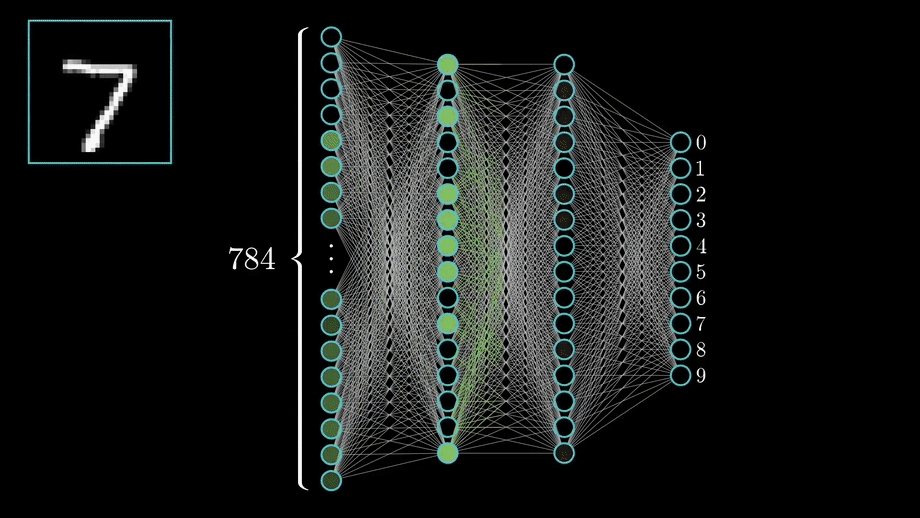
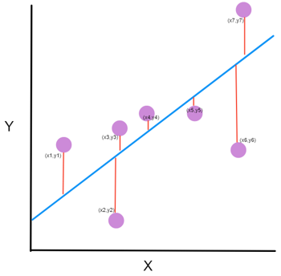
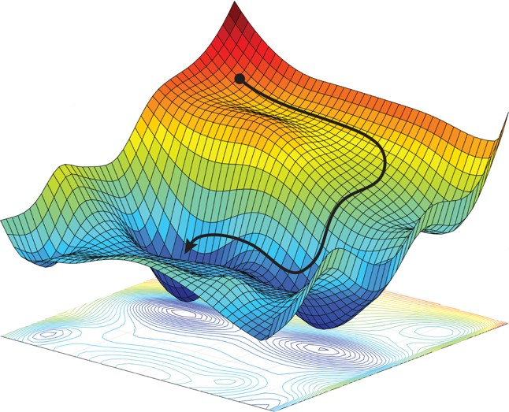
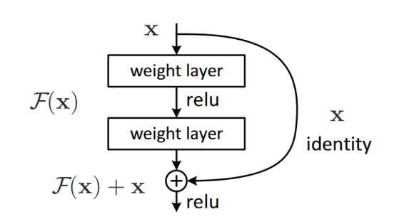
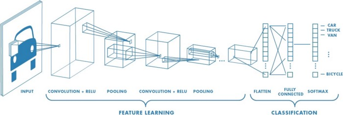
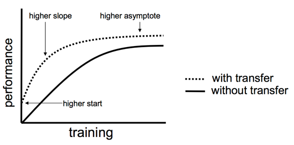
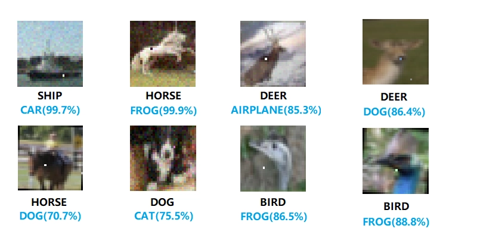
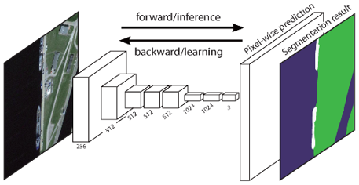

# List of things to know
## Was könnten die Gründe für den jetztigen ML Hype sein?
- Die Menge an kreierten Daten ist in den letzten Jahrzenten immens gestiegen
- Daten werden diesbezüglich auch oft als das "neue Öl" bezeichnet
- Machine Learning benötigt extrem viele Daten
---

## Was sind mögliche Probleme bei ML Applikationen?
- Erklärbarkeit
  - Für den Einsatz der KI bei der Strafverfolgung, Finanzdienstleistungen etc. wird es wichtig zu wissen, wo die KI falsch liegen könnte und wie sie zu diesem Ergebnis gekommen ist.
- Reproduzierbarkeit und Korrektheit
  - Maschinelles Lernen muss reproduzierbar und deterministisch sein, damit es in lebenskritischen Systemen wie autonomes Fahren, Gesundheitsführsorge eingesetzt werden kann
- Security
  - KI dringt in immer mehr Bereiche eines Unternehmens ein
  - Dadurch ist die Sicherheit zu einem Problem geworden
- Privacy
  - Gesichtserkennung, etc.
---

## Was ist ein Perceptron?
- Eine Art künstlichen Neurons
- Es bestitzt immer genau einen Output (0 oder 1), kann aber mehrere Inputs haben
- Jeder Input besitzt eine **Gewichtung** &rarr; Sie sagt aus, wie wichtig der Input ist
---

## Was ist ein Sigmoid Neuron?
- Modifiziertes Perceptron
  - Kleine Änderungen der Gewichte und des Bias haben nur kleine Auswirkungen auf den Output
- Input/Output können **zwischen** 0 und 1 geben
- Der Output wird über die Sigmoidfunktion berechnet
  - Activation Funktion
---

## Was ist die Sigmoid Funktion und wozu dient sie?
- Ist eine Activation Funktion
---

## Was sind Activation Functions? Beispiele!
- [Ist die Funktion](https://medium.com/the-theory-of-everything/understanding-activation-functions-in-neural-networks-9491262884e0), die angibt, ob/ wie stark ein Neuron feuern soll
- Beispiele: 
  - ReLu, Softmax
---

## Was für Learning Kategorien gibt es?
* Supervised
  * Erfordert ein labeled Datenset
  * Vorhersage des Modells wird mit dem Label des Datensets verglichen 
    * Das Netzwerk lernt daraus
  * Genutzt bei
    * Klassifikation
    * Regression
* Unsupervised 
  * Hat keine gelabelten Daten
    * Kein richtig oder falsch
  * Algorithmus modelliert die Struktur der Daten
    * Er **entdeckt** und **präsentiert**
  * Genutzt bei
    * Clustering (Social Medie &rarr; Personen die du vielleicht kennst)
    * Assoziierung (Beziehungen der Daten)
* Semisupervised
  * Daten besitzen nur teilweise ein Label
  * Anhand der labeled Daten werden die Daten, die kein Label haben, predicted
  * Daten werden dann wieder eingespeißt
* Reinforcement
  * Agent (AI) soll Ziele erfüllen
  * Belohnung und Bestrafung
    * Bewertung der ausgeführten Aktion des Agenten
  * Agent will die Belohnung maximieren
  * Belohnungspolitik muss festgelegt werden
  * Agent führt zufällige Aktionen aus und lernt anhand der Belohnungen/Strafen
---

## Was ist ein Tensor?
Kommt von lat. **tendere** &rarr; **strecken**
- Ist eine Datenstruktur
  - Vergleichbar mit Arrays
- Kann verschiedene Dimensionen haben
---

## Was ist Forwardpropagation?
* Input wird durch die Layer des Netzes geschickt
* Am Ende wird eine Vorhersage getroffen
* An jedem Neuron werden alle Ausgaben der Vorgänger zusammen in die Activationfunction gegeben
* Anhand dessen wird dann berechnet wie stark oder ob das Neuron aktiviert wird
* Input ist bspw. die 7 und es soll die 7 predicted werden
* Verifiziert wird der Output des Netzes durch die Loss function
  

---
## Was ist eine Loss Function?
* **Loss** bzw. **Error** ist der Unterschied zwischen Ausgabewert des NN und dem tatsächlichen Wert
* Dieser Wert zeigt ob das NN für ein Input gut oder schlecht gearbeitet hat
* Je größer der Loss/Verlust, desto schlechter hat das Netz gearbeitet
* Je kleiner desto besser
* Das Ziel des NNs ist es also den Verlust möglichst zu minimieren
* Anhand des Verlusts kann dann festgestellt werden wie die Weights und Biases angepasst werden müssen, das geschieht dann über Gradient Descent
* Hier Beispiel von Mean Squared Error

---
## Was ist Gradient Descent?
* Optimizer:
  * Lern prozess ist letztendlich ein großes Optimierungs problem, bei dem die Gewichte und Biase angepasst werden müssen
    * Müssen so angepasst werden, dass die Loss function minimiert wird
  * Die Gewichte und Biase können z.B. durch iterative Algorithmen optimiert werden
* Gradient Descent (Gradienten Abstieg):
  * Man kann sich das Netz wie eine Funktion vorstellen
  * Man möchte quasi von einer zufälligen Position zum Minimum der Funktion kommen
  * Die Richtung in die man gehen muss liefert der Gradient Descent
  * Der Gradient Descent geht in die Richtung des steilsten Abstiegs mit negativen Gradienten 
  * An jedem Punkt wird der nächste steilste Abstieg neu berechnet!
  

---
## Was ist Backwardpropagation?
* Methode, um die weights und biases der Neuronen anzupassen
* Ist das eigentliche Lernen des Netzwerkes, da dort die weights und biase des Netzes angepasst werden
* Die Erkenntnisse der Loss Function und des Gradient Descent werden dann wieder Rückwärts durch das Netz gegeben
* Dadurch können dann die Weights und Biases der einzelnen Neuronen unterschiedlich angepasst werden
* Im Bild kann man sehen wie die Informationen erst vorwärts und dann rückwärts durch das Netz geschickt werden
  

---
## Warum kann ML auf emb. Devices zu Problemen führen?
---
## Was ist ResNet?
**Deep Residual Neural Network**
* Deep bedeutet einfach dass es mehrere hidden Layer besitzt
* Residual = Residuum
* Residuum ist in der Mathematik der Fehler bei einem Ergebnis:
  * Wenn man zb das Alter einer Person schätzen soll und man sie auf 16 schätzt, sie aber 18 ist, dann ist das Residuum 2, wenn man sie auf 21 schätzt, wäre das Residuum -3. Also wie viel man addieren muss um auf den tatsächlichen Wert zu gelangen
* Deep NNs sind schwer zu trainieren aufgrund des “Vanishing gradient problem” — Problem des verschwindenden Gradienten - wenn der Gradient zu früheren Schichten zurückgegeben wird, kann das wiederholte Multiplizieren den Gradienten verschwindend klein machen	
* Deep NNs haben eine höhere Errorrate als Flachere NNs
* Lösung sind Identity Shortcuts,
  * Die Identity Function gibt immer das zurück was reingegeben wird
  * Identity Kopiert einfach nur den input
  * Ermöglicht das trainieren von "*tieferen*" (Deeper) Neuronalen Netzen als zuvor

--- 
## Was ist ein Residuum?
- Ein Fehler bei einem Ergebnis
  - Wenn man zb das Alter einer Person schätzen soll und man sie auf 16 schätzt, sie aber 18 ist, dann ist das Residuum 2
&rarr; Was man **addieren** muss um auf den tatsächlichen Wert zu gelangen
---

## Was ist ein sog. vanishing Gradient?
* Deep NNs sind schwer zu trainieren aufgrund des “Vanishing gradient problem” —Problem des verschwindenden Gradienten - wenn der Gradient zu früheren Schichten zurückgegeben wird, kann das wiederholte Multiplizieren den Gradienten verschwindend klein machen	
> In machine learning, the vanishing gradient problem is encountered when training artificial neural networks with gradient-based learning methods and backpropagation. 
> In such methods, each of the neural network's weights receive an update proportional to the partial derivative of the error function with respect to the current weight in each iteration of training. 
> The problem is that in some cases, the gradient will be vanishingly small, effectively preventing the weight from changing its value.
> In the worst case, this may completely stop the neural network from further training.

Rectifier Funktionen wie ReLu leiden weniger unter dem Vanishing Gradient Problem, weil sie nur ein eine Richtung "minimieren".

---

## Was ist der Identity Shortcut?
- Löst das Problem des *vanishing Gradient* 
- Identity Funktion gibt immer das zurück was reingegeben wird
  - Identity **kopiert** den Input
  

Das Summenzeichen ist eine elementweise Summe

---
## Was ist Klassifikation?
- Der Output bei einer Klassifikation ist eine Kategorie
  - "Rot", "Blau"; "Links", "Rechts"
  - Schrifterkennung, Gesichtserkennung, Objekterkennung
---

## Was ist Regression? 
- Output ist ein realer Wert
  - Bsp: 3.14€; 250Kg
  - Grundstückspreise, Verkaufszahlen
  ---

## Was ist der ArcTan2?
> arctan2(y, x)
- Erweiterung des Arkustangens
- Input sind zwei reelle Zahlen *y* und *x*
- Output
  - Über alle vier Quadranten
  - In Rad

# Our presentation
---
## Learning Categories
---
## ResNet
---
## Forward Propagation
---
## Backward Propagation
---
## Our Implementations
---

# Presentation Roeder & Mueller
## CNN - Convolutional Neural Network
- Gerne für Klassifikationen von Bildern genommen
  - Erkennung von bspw. Objekten und Gesichtern, ... 

- Unter Convolution versteht man hier das Zusammenfassen von Features des Input Bildes mit Hilfe des Kernels
- Dabei wird die Beziehung zwischen den Pixeln beibehalten
  - Geschieht, da die Image Features **"gelernt"** werden
  - Dazu wird der Kernel verwendet

---
## Kernel

---
## CNN Pooling Layer
- Aggregation der Ergebnisse von Convolutional Layern
- Nur das **stärkste** Signal wird weitergegeben
  - Schwächere Signale werden verworfen
- Ziele des Poolings
  - Weitergabe des relevantesten Signals an die nächste Schicht
  - Erreichen einer abstrakteren Repräsentation des Inhaltes
  - Reduktion der Parameter eines Netzes

Hier: 4 Matrix Ergebnisse aus einem 2 $\times$ 2-Kernel werden auf **eine** Zahl reduziert.

---
## CNN-Dense / Fully Connected Layer
Fully/Dense Layer bedeutet eigentlich nur, dass die Weights wie die Elemente in einer Matrix sind und das damit der Input Vektor zum Output Vektor transformiert ist. Jedes Input Neuron ist mit jedem Output Neuron Verbunden.

Bei einem Convolutional Layer sind die "Weights" dann ganze Filter/Convolutions und der Output eine neue Repräsentation des Inputs.
## R-CNN
> [Dense und Fully Connected](https://forums.fast.ai/t/dense-vs-convolutional-vs-fully-connected-layers/191) bedeutet das selbe
>-Jeremy Howard

> [A linear operation](https://forums.fast.ai/t/dense-vs-convolutional-vs-fully-connected-layers/191/3) in which every input is connected to every output by a weight (so there are n_inputs * n_outputs weights - which can be a lot!). Generally followed by a non-linear activation function
>-Jeremy Howard

> [Neurons in a fully connected layer](https://cs231n.github.io/convolutional-networks/#conv) have full connections to all activations in the previous layer, as seen in regular Neural Networks. Their activations can hence be computed with a matrix multiplication followed by a bias offset. See the Neural Network section of the notes for more information.

---
## CNN-Aktivierungsfunktionen und Optimierung
- Meist durch ReLU (Rectified Linear Unit)
  - Werte < 0 &rarr; 0
  - Werte > 0 &rarr; werden nicht verändert
- Letzter Layer hat bei der Klassifizierung eine **Softmax**-Aktivierung
  - Output aller Output-Neuronen addiert sich zu 1
  - Gibt dadurch die Wahrscheinlichkeit des entsprechenden Outputs
- Gewichte der Filter (Kernel) und Fully-Connected-Layer werden anfangs **zufällig** gewählt und **während** des Trainings durch **Backpropagation** weiter optimiert
---
## R-CNN (Region-based CNN)
- Kombination aus "Rectangular Region Proposals" und CNNs
- Rectangular Region Proposal
  - Methode um rechteckige Regionen in Bildern zu bestimmen
- Zweistufiger Objekterkennungs-Algorithmus
  - Schritt 1: Teilmenge (ca. 2000) von Regionen eines Bildes identifizieren/vorschlagen (Bspw. durch Selective Search Methode)
  - Schritt 2: Für jede Region das entsprechende Objekt klassifizieren

### Selective Search Methode
- Einführende **"Übersegmentierung"** des Input-Bildes in viele kleine Regionen
- **Rekursives** Kombinieren kleiner (ähnlicher) Regionen zu größeren

Beispiel:
1. Bild-Input
2. Regions of Interest (RoI) mit Hilfe eines **"external proposer"** (Bspw. Selective Search) vorschlagen und deren Größe für das CNN anpassen
3. CNN-Prozess für alle RoI anwenden
   1. Bounding Box regressors verfeinern die Boxen, in denen sich Objekte befinden
4. Obkjekte in Regionen mit HIlfe der **Support Vector Machine** (SVM) klassifizieren

#### Support Vector Machine
- [Verfahren zur Unterteilung einer Menge von Objekten in Klassen](https://towardsdatascience.com/support-vector-machine-introduction-to-machine-learning-algorithms-934a444fca47)

Beispiel:
- Trennfläche zwischen den Klassen (Grün und Blau) mit maximalem Abstand zu Objekten im Vektorraum einpassen 
- Durch das Maximieren der Distanz zwischen den Klassen hat zur Folge, dass zukünftige Daten mit einer höheren Konfidenz klassifiziert werden können

- Die Funktion die eingepasst wird ist bei zwei Klassen eine Linie
- Kann sich bei mehr Klassen allerdings verändern
  - Kurven

---
## Fast R-CNN
- Besitzt eine bessere **mean Average Precision** (mAP)
  - Es ist also **schneller**
  - Liegt daran, dass bei R-CNN für alle 2000 RoI das CNN ausgeführt werden musste
- RoI wird hier erst abgestimmt, nachdem das CNN einmal durchgeführt wurde
---
## Faster R-CNN
- Funktionsweise
  - Wie Fast R-CNN mit dem Unterschied, dass es keine **external region proposal** Methode (Selective Search) benötigt.
  - Selective Search wird durch ein **Region Proposal Network** (RPN) ersetzt
    - Dieses ist schneller als Selective Search

### Region Proposal Network
- Schneller als Selective Search
- Generiert Vorschläge für mögliche Objekte
- Lernt aus Feature Maps des Basis-Networks bessere Vorschläge zu machen
---
## YOLO
- **Objekterkennungs-Algorithmus**, der für real-time processing verwendet wird
  - Schnell
- Algorithmus sieht das original Bild nur **ein** mal
- Das gesamte Bild wird nur von einem NN bearbeitet
- Unterteilung des Bildes in Regionen
  - Vorhersagen für Bounding Boxen und Wahrscheinlichkeit jeder Region
- Nur **ein** Objekt pro Region
- Vorhersagen werden durch den *globalen Kontext** des Bildes getroffen
---
## Single Shot Detection
- Ähnlich wie YOLO
- Definition von mehreren **Standard Bounding Boxen** mit verschiedenen Seitenverhältnissen und Maßstäben
- Standardboxen werden mit den Objektkategorien verglichen
- Genauer als YOLO, da es mehr Zwischenlagen/Zwischenschritte hat
  
&rarr; Gute Genauigkeit bei moderater Geschwindigkeit

---
## Transfer Learning
> [Transfer learning](https://machinelearningmastery.com/transfer-learning-for-deep-learning/) is a machine learning technique where a model trained on one task is re-purposed on a second related task.

> Transfer learning is an optimization that allows rapid progress or improved performance when modeling the second task.

Vorteile:
  - Model hat bereits Vorwissen
  - Schnellere Anpassung
  - Besseres Gesamtergebnis

---
## Hyperparameter Tuning
> A hyperparameter is a parameter whose value is set before the learning process begins

- [Parameter](https://towardsdatascience.com/hyperparameter-tuning-c5619e7e6624), die nicht "gelernt" werden können

Neuronen
  - Wenige 
    - Underfitting (Komplexe Daten nicht abbildbar)
  - Viele Neuronen
    - Nicht alle Neuronen können gut angelernt weredn
      - Informationen der Trainingsdaten nicht ausreichend
    - Hohe Trainingsdauer

### Grid Search - Tuning
- Grid Search
  - Baut/Lernt für jeden Parameter ein neus Modell
  - Rechenaufwendig

---
## Adversarial Attacks / One Pixel-Attack
Es ist möglich mit einem eingefügten Pixel (der geschickt platziert wurde) ein NN zu täuschen.

> [Adversarial](https://openai.com/blog/adversarial-example-research/) examples are inputs to machine learning models that an attacker has intentionally designed to cause the model to make a mistake; they’re like optical illusions for machines

### Schutzmöglichkeiten
- Adversial Training
  - Brute-Force (eigene adversarial Bilder)
  - Verbessert Generalisation
- Defense Distillation
  - Einführung eines zweiden Modells
  - Dieses prüft auf Wahrscheinlichkeitswerte
---

# Presentation Frieß & Schaebler
## Was ist der Kontrast?
Unterschied zwischen hellen und dunklen Bildbereichen

---
## Was ist Gamma?
Gamma ist ein Wert für die relative Helligkeit bzw. Dunkelheit des Bilds

---
## Was ist die Segmentierung?
Einteilen des Bildes in Teilbereiche (Segmente), legt die Objektklassen der Segmente fest und maskiert die Objekte

### Was ist die Semantische Segmentierung?
Klassifiziert alle Pixel eines Bildes in sinnvolle Objektklassen.

### Was ist die Instanz Segmentierung?

Instanz Segmentierung: Identifiziert jede Instanz jedes Objekts in einem Bild

---
## Was ist die Histogrammbasierte Segmentierung?

Graustufenbild wird in zwei Segmente unterteilt schwarz/weiß was dann für Vordergrund (das Objekt) und Hintergrund steht

---
## Was ist das Schwellenwertverfahren?
Schwellenwertverfahren =  pixelorientiertes vollständiges Segmentierungsverfahren 
* pixelorientiert: Jedes Pixel wird in seine Graustufenrepräsentation umgewandlet
* vollständiges Verfahren: Jedes Pixel wird zwingend einem Segment zugeordnet
Richtigen Schwellenwert wählen ist schwer. Zu niedrig werden zu viele Pixel weiß. Zu hoch und es werden zu viele Pixel schwarz.
---
## Gibt noch Graphenbasierte Segmentierungsverfahren
* Random Walker

---
## Regionbasierte Segmentierungsverfahren
Es gibt also eine Homogenitätskriterium die bestimmt ob zwei benachbarte Pixel zusammenpassen oder nicht und anhand dessen wird das gesamte Bild segmentiert.
### Region Merging
Region Merging ist ein Segmentierungsalgorithmus der zur Gruppe der Regionenbasierten Segmentierung gehört

1. Initial wird jedes Pixel zu einem Segment erklärt
2. Festlegen des Homogenitätskriterium (z.B. ein Grauwertunterschied zwischen zwei betrachteten Nachbarn)
3. Zwei benachbarte Regionen werden zusammengefasst, wenn sie auch gemeinsam das Homogenitätskriterium erfüllen 
4. Segmentierung ist beendet, wenn keine zwei Regionen mehr zusammengefasst werden können
---
## Kantenbasiertes Segmentierungsverfahren:

Bei der Kantenerkennung wird lediglich versucht, die Bereiche in einem Bild zu finden, in denen sich die Helligkeit oder die Farbe eines Pixelbereiches stark ändert. 

Ein hoher Wert zeigt eine steile Änderung an und ein niedriger Wert zeigt eine flache Änderung an.

---

## Kantenerkennung mit Sobel Operator:
Bei Verwendung der Sobel-Kantenerkennung wird das Bild zuerst separat in X- und Y-Richtung verarbeitet und dann zu einem neuen Bild kombiniert, das die Summe der X- und Y-Kanten des Bildes darstellt.

Ein Kernel ist eine 3 x 3-Matrix, die aus unterschiedlich (oder symmetrisch) gewichteten Indizes besteht. Dies stellt den Filter dar, den wir für eine Kantenerkennung implementieren werden
RGB -> Grayscale

---
## Region Based Semantic Segmentation:
„Segmentierung durch Erkennung“-Pipeline
Schritte:
* Zufälliges Auswählen von Bereichen innerhalb des Bilds
* Anwendung von Klassifikation auf diese Bereiche
* Anhand der Klassifikationsergebnisse werden Vorhersagen für die einzelnen Pixel getätigt

Segmentierungsergebnisse auf Basis von Ergebnissen der Objekterkennung
* Selective Search zum finden von möglichen Objekten
* Gefundene Objekte durch ein CNN (Convolutional Neural Network) nach Eigenschaften durchsuchen
* Klassifizierung jedes Bereichs mittels einer klassenspezifischen linearen Support Vector Machine
---
## Fully Convolutional Network

Schichten des Netzwerkes sind nur lokal verbunden
* Anders als bei CNNs fehlt der Dense-Layer
* Weniger Parameter nötig, daher schnellere Bearbeitung
* Für ein Ergebnis werden zwei Teile benötigt:
  * Downsampling-Pfad: Erfassung semantischer/kontextbezogener Informationen
  * „Was ist in dem Bereich zu finden?“
  * Upsampling-Pfad: Wiederherstellung von räumlichen Informationen
  * „Wo genau ist dieser Bereich zu finden?“

---

## SegNet
* A Deep Convolutional Encoder-Decoder Architecture
* Unterstützt mehrere Klassen pixelweise zu segmentieren
* Basierend auf FCN
* Entwickelt von Mitgliedern der „Computer Vision and Robotics Group“ der Universität Cambridge
* Eingabe: RGB-Bild
* Ausgabe: Ausgabebild mit segmentierten Klassen
---
# Presentation Nunn & Awerjanow

## 5 Essentials for Reinforcement Learning
    - Action
    - Environment
    - Reward
    - State
    - Agent
---

## Markow-Decision problem
> MDP(S, A, P, R)

- S: Menge an States (Observation Space)
- A: Menge von Aktionen (Action Space)
- P: Transitionswahrscheinlichkeit
  - Wahrscheinlichkeit von Zustand S und Aktion A in Zustand S' zu gelangen
- R: Belohnungsfunktion

&rarr; Ziel: Finde eine Policy, die den **besten** Reward erzielt!
---

## Policy
- Strategie, die das Verhalten des Agenten beschreibt
- Zwei verschiedene Arten von Policy:
  - Deterministische Policy
  - Stochastische Policy
---

## Reward
- Ziel des Agenten ist die **Maximierung** des Rewards
- Discount-Faktor $\gamma$[0,1] bestimmt, wie weit in die Zukunft geblickt werden soll
---

## Value Function
- Vorhersage für zukünftige Belohnungen
- Schätzt ab, wie gut oder schlecht ein State ist
  - Nächste Aktion ist davon abhängig

### V-Values (State-Value Function)
- Beschreibt Wert *V* eines States s beim Befolgen einer Policy

### Q-Values (Action-Value Function)
- Beschreibt den Wert *Q* den eine Aktion *a* in einem State *s* hat 

---
## Model
- Repräsentiert die Umgebung des Agenten
- Sagt voraus, was die Umgebung als nächstes tun wird
- *P* erratet den nächsten State
- *R* erratet den nächsten Reward 
---

## How does it learn?
- Exploration und Exploitation
  - Trial-and-Error
  - Exploitation nutzt den besten Pfad um den Reward zu maximieren
  - Exploration nutzt unbekannte Wege um neues zu Erkunden

&rarr; Es sollte immer ein zwischending aus Exploitation und Exploration geben, damit die Policy verbessert wird
---

## Limitations of Reinforcement Learning
- Viele Versuche nicht immer möglich
- Benötigt viele Versuche
  - Roboterarm Objekte Greifen: 580.000 Versuche
- Grenzen von virtuellen Umgebungen
  - Dynamiken der Umgebung schwer realisierbar
  - Schwer erlernbare Umgebung
- Zu viele Actions und States die berechnet werden müssen
  - Rechenaufwand
---

## Q-Learning

- Output der Bellman-Funktion
  - Inputs sind State und Action
