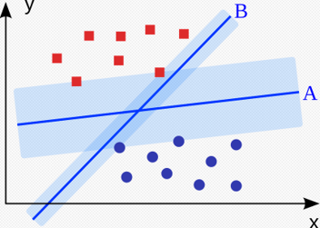
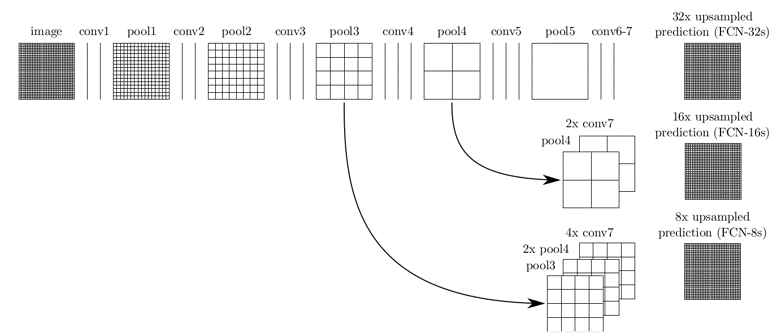

# List of things to know
## Was könnten die Gründe für den jetztigen ML Hype sein?
## Was sind mögliche Probleme bei ML Applikationen?
- Erklärbarkeit
- Reproduzierbarkeit und Korrektheit
- Security, Privacy
## Was ist ein Neuron?
## Was ist die Sigmoid Funktion und wozu dient sie?
## Was sind Activation Functions? Beispiele!
ReLu, Softmax
## Was für Learning Kategorien gibt es?
* Supervised
* Unsupervised
* Semisupervised
* Reinforcement
## Was ist ein Tensor?
## Was ist Forwardpropagation?
## Was ist eine Loss Function?
## Was ist Gradient Descent?
## Was ist Backwardpropagation?
## Warum kann ML auf emb. Devices zu Problemen führen?
## Was ist ResNet?
## Was ist ein Residuum?
## Was ist der Identity Shortcut?
## Was ist Klassifikation?
## Was ist Regression? 
## Was ist der ArcTan2?
# Our presentation
---
## Learning Categories
---
## ResNet
---
## Forward Propagation
---
## Backward Propagation
---
## Our Implementations
---

# Presentation Roeder & Mueller
## CNN
---
## Kernel

---
## CNN Pooling Layer
- Aggregation der Ergebnisse von Convolutional Layern
- Nur das **stärkste** Signal wird weitergegeben
  - Schwächere Signale werden verworfen
- Ziele des Poolings
  - Weitergabe des relevantesten Signals an die nächste Schicht
  - Erreichen einer abstrakteren Repräsentation des Inhaltes
  - Reduktion der Parameter eines Netzes

Hier: 4 Matrix Ergebnisse aus einem 2 $\times$ 2-Kernel werden auf **eine** Zahl reduziert.

---
## CNN-Dense / Fully Connected Layer
> [Dense und Fully Connected](https://forums.fast.ai/t/dense-vs-convolutional-vs-fully-connected-layers/191) bedeutet das selbe
>-Jeremy Howard

> [A linear operation](https://forums.fast.ai/t/dense-vs-convolutional-vs-fully-connected-layers/191/3) in which every input is connected to every output by a weight (so there are n_inputs * n_outputs weights - which can be a lot!). Generally followed by a non-linear activation function
>-Jeremy Howard

> [Neurons in a fully connected layer](https://cs231n.github.io/convolutional-networks/#conv) have full connections to all activations in the previous layer, as seen in regular Neural Networks. Their activations can hence be computed with a matrix multiplication followed by a bias offset. See the Neural Network section of the notes for more information.

---
## CNN-Aktivierungsfunktionen und Optimierung
- Meist durch ReLU (Rectified Linear Unit)
  - Werte < 0 &rarr; 0
  - Werte > 0 &rarr; werden nicht verändert
- Letzter Layer hat bei der Klassifizierung eine **Softmax**-Aktivierung
  - Output aller Output-Neuronen addiert sich zu 1
  - Gibt dadurch die Wahrscheinlichkeit des entsprechenden Outputs
- Gewichte der Filter (Kernel) und Fully-Connected-Layer werden anfangs **zufällig** gewählt und **während** des Trainings durch **Backpropagation** weiter optimiert
---
## R-CNN (Region-based CNN)
- Kombination aus "Rectangular Region Proposals" und CNNs
- Rectangular Region Proposal
  - Methode um rechteckige Regionen in Bildern zu bestimmen
- Zweistufiger Objekterkennungs-Algorithmus
  - Schritt 1: Teilmenge (ca. 2000) von Regionen eines Bildes identifizieren/vorschlagen (Bspw. durch Selective Search Methode)
  - Schritt 2: Für jede Region das entsprechende Objekt klassifizieren

### Selective Search Methode
- Einführende **"Übersegmentierung"** des Input-Bildes in viele kleine Regionen
- **Rekursives** Kombinieren kleiner (ähnlicher) Regionen zu größeren

Beispiel:
1. Bild-Input
2. Regions of Interest (RoI) mit Hilfe eines **"external proposer"** (Bspw. Selective Search) vorschlagen und deren Größe für das CNN anpassen
3. CNN-Prozess für alle RoI anwenden
   1. Bounding Box regressors verfeinern die Boxen, in denen sich Objekte befinden
4. Obkjekte in Regionen mit HIlfe der **Support Vector Machine** (SVM) klassifizieren

#### Support Vector Machine
- Verfahren zur Unterteilung einer Menge von Objekten in Klassen

Beispiel:
Trennfläche zwischen den Klassen (Rot und Blau) mit maximalem Abstand zu Objekten im Vektorraum einpassen 

---
## Fast R-CNN
- Besitzt eine bessere **mean Average Precision** (mAP)
  - Es ist also **schneller**
  - Liegt daran, dass bei R-CNN für alle 2000 RoI das CNN ausgeführt werden musste
- RoI wird hier erst abgestimmt, nachdem das CNN einmal durchgeführt wurde
---
## Faster R-CNN
- Funktionsweise
  - Wie Fast R-CNN mit dem Unterschied, dass es keine **external region proposal** Methode (Selective Search) benötigt.
  - Selective Search wird durch ein **Region Proposal Network** (RPN) ersetzt
    - Dieses ist schneller als Selective Search

### Region Proposal Network
- Schneller als Selective Search
- Generiert Vorschläge für mögliche Objekte
- Lernt aus Feature Maps des Basis-Networks bessere Vorschläge zu machen
---
## YOLO
- **Objekterkennungs-Algorithmus**, der für real-time processing verwendet wird
  - Schnell
- Algorithmus sieht das original Bild nur **ein** mal
- Das gesamte Bild wird nur von einem NN bearbeitet
- Unterteilung des Bildes in Regionen
  - Vorhersagen für Bounding Boxen und Wahrscheinlichkeit jeder Region
- Nur **ein** Objekt pro Region
- Vorhersagen werden durch den *globalen Kontext** des Bildes getroffen
---
## Single Shot Detection
- Ähnlich wie YOLO
- Definition von mehreren **Standard Bounding Boxen** mit verschiedenen Seitenverhältnissen und Maßstäben
- Standardboxen werden mit den Objektkategorien verglichen
- Genauer als YOLO, da es mehr Zwischenlagen/Zwischenschritte hat
  
&rarr; Gute Genauigkeit bei moderater Geschwindigkeit

---
## Transfer Learning
> [Transfer learning](https://machinelearningmastery.com/transfer-learning-for-deep-learning/) is a machine learning technique where a model trained on one task is re-purposed on a second related task.

> Transfer learning is an optimization that allows rapid progress or improved performance when modeling the second task.

Vorteile:
  - Model hat bereits Vorwissen
  - Schnellere Anpassung
  - Besseres Gesamtergebnis

---
## Hyperparameter Tuning
> A hyperparameter is a parameter whose value is set before the learning process begins

- [Parameter](https://towardsdatascience.com/hyperparameter-tuning-c5619e7e6624), die nicht "gelernt" werden können

Neuronen
  - Wenige 
    - Underfitting (Komplexe Daten nicht abbildbar)
  - Viele Neuronen
    - Nicht alle Neuronen können gut angelernt weredn
      - Informationen der Trainingsdaten nicht ausreichend
    - Hohe Trainingsdauer

### Grid Search - Tuning
- Grid Search
  - Baut/Lernt für jeden Parameter ein neus Modell
  - Rechenaufwendig

---
## Adversarial Attacks / One Pixel-Attack
Es ist möglich mit einem eingefügten Pixel (der geschickt platziert wurde) ein NN zu täuschen.

> [Adversarial](https://openai.com/blog/adversarial-example-research/) examples are inputs to machine learning models that an attacker has intentionally designed to cause the model to make a mistake; they’re like optical illusions for machines

### Schutzmöglichkeiten
- Adversial Training
  - Brute-Force (eigene adversarial Bilder)
  - Verbessert Generalisation
- Defense Distillation
  - Einführung eines zweiden Modells
  - Dieses prüft auf Wahrscheinlichkeitswerte
---

# Presentation Frieß & Schaebler
## Was ist der Kontrast?
Unterschied zwischen hellen und dunklen Bildbereichen

---
## Was ist Gamma?
Gamma ist ein Wert für die relative Helligkeit bzw. Dunkelheit des Bilds

---
## Was ist die Segmentierung?
Einteilen des Bildes in Teilbereiche (Segmente), legt die Objektklassen der Segmente fest und maskiert die Objekte

### Was ist die Semantische Segmentierung?
Klassifiziert alle Pixel eines Bildes in sinnvolle Objektklassen.

### Was ist die Instanz Segmentierung?

Instanz Segmentierung: Identifiziert jede Instanz jedes Objekts in einem Bild

---
## Was ist die Histogrammbasierte Segmentierung?

Graustufenbild wird in zwei Segmente unterteilt schwarz/weiß was dann für Vordergrund (das Objekt) und Hintergrund steht

---
## Was ist das Schwellenwertverfahren?
Schwellenwertverfahren =  pixelorientiertes vollständiges Segmentierungsverfahren 
* pixelorientiert: Jedes Pixel wird in seine Graustufenrepräsentation umgewandlet
* vollständiges Verfahren: Jedes Pixel wird zwingend einem Segment zugeordnet
Richtigen Schwellenwert wählen ist schwer. Zu niedrig werden zu viele Pixel weiß. Zu hoch und es werden zu viele Pixel schwarz.
---
## Gibt noch Graphenbasierte Segmentierungsverfahren
* Random Walker

---
## Regionbasierte Segmentierungsverfahren
Es gibt also eine Homogenitätskriterium die bestimmt ob zwei benachbarte Pixel zusammenpassen oder nicht und anhand dessen wird das gesamte Bild segmentiert.
### Region Merging
Region Merging ist ein Segmentierungsalgorithmus der zur Gruppe der Regionenbasierten Segmentierung gehört

1. Initial wird jedes Pixel zu einem Segment erklärt
2. Festlegen des Homogenitätskriterium (z.B. ein Grauwertunterschied zwischen zwei betrachteten Nachbarn)
3. Zwei benachbarte Regionen werden zusammengefasst, wenn sie auch gemeinsam das Homogenitätskriterium erfüllen 
4. Segmentierung ist beendet, wenn keine zwei Regionen mehr zusammengefasst werden können
---
## Kantenbasiertes Segmentierungsverfahren:

Bei der Kantenerkennung wird lediglich versucht, die Bereiche in einem Bild zu finden, in denen sich die Helligkeit oder die Farbe eines Pixelbereiches stark ändert. 

Ein hoher Wert zeigt eine steile Änderung an und ein niedriger Wert zeigt eine flache Änderung an.

---

## Kantenerkennung mit Sobel Operator:
Bei Verwendung der Sobel-Kantenerkennung wird das Bild zuerst separat in X- und Y-Richtung verarbeitet und dann zu einem neuen Bild kombiniert, das die Summe der X- und Y-Kanten des Bildes darstellt.

Ein Kernel ist eine 3 x 3-Matrix, die aus unterschiedlich (oder symmetrisch) gewichteten Indizes besteht. Dies stellt den Filter dar, den wir für eine Kantenerkennung implementieren werden
RGB -> Grayscale

---
## Region Based Semantic Segmentation:
„Segmentierung durch Erkennung“-Pipeline
Schritte:
* Zufälliges Auswählen von Bereichen innerhalb des Bilds
* Anwendung von Klassifikation auf diese Bereiche
* Anhand der Klassifikationsergebnisse werden Vorhersagen für die einzelnen Pixel getätigt

Segmentierungsergebnisse auf Basis von Ergebnissen der Objekterkennung
* Selective Search zum finden von möglichen Objekten
* Gefundene Objekte durch ein CNN (Convolutional Neural Network) nach Eigenschaften durchsuchen
* Klassifizierung jedes Bereichs mittels einer klassenspezifischen linearen Support Vector Machine
---
## Fully Convolutional Network

Schichten des Netzwerkes sind nur lokal verbunden
* Anders als bei CNNs fehlt der Dense-Layer
* Weniger Parameter nötig, daher schnellere Bearbeitung
* Für ein Ergebnis werden zwei Teile benötigt:
  * Downsampling-Pfad: Erfassung semantischer/kontextbezogener Informationen
  * „Was ist in dem Bereich zu finden?“
  * Upsampling-Pfad: Wiederherstellung von räumlichen Informationen
  * „Wo genau ist dieser Bereich zu finden?“

---

## SegNet
* A Deep Convolutional Encoder-Decoder Architecture
* Unterstützt mehrere Klassen pixelweise zu segmentieren
* Basierend auf FCN
* Entwickelt von Mitgliedern der „Computer Vision and Robotics Group“ der Universität Cambridge
* Eingabe: RGB-Bild
* Ausgabe: Ausgabebild mit segmentierten Klassen
---
# Presentation Nunn & Awerjanow

## 5 Essentials for Reinforcement Learning
    - Action
    - Environment
    - Reward
    - State
    - Agent
---

## Markow-Decision problem
> MDP(S, A, P, R)

- S: Menge an States (Observation Space)
- A: Menge von Aktionen (Action Space)
- P: Transitionswahrscheinlichkeit
  - Wahrscheinlichkeit von Zustand S und Aktion A in Zustand S' zu gelangen
- R: Belohnungsfunktion

&rarr; Ziel: Finde eine Policy, die den **besten** Reward erzielt!
---

## Policy
- Strategie, die das Verhalten des Agenten beschreibt
- Zwei verschiedene Arten von Policy:
  - Deterministische Policy
  - Stochastische Policy
---

## Reward
- Ziel des Agenten ist die **Maximierung** des Rewards
- Discount-Faktor $\gamma$[0,1] bestimmt, wie weit in die Zukunft geblickt werden soll
---

## Value Function
- Vorhersage für zukünftige Belohnungen
- Schätzt ab, wie gut oder schlecht ein State ist
  - Nächste Aktion ist davon abhängig

### V-Values (State-Value Function)
- Beschreibt Wert *V* eines States s beim Befolgen einer Policy

### Q-Values (Action-Value Function)
- Beschreibt den Wert *Q* den eine Aktion *a* in einem State *s* hat 

---
## Model
- Repräsentiert die Umgebung des Agenten
- Sagt voraus, was die Umgebung als nächstes tun wird
- *P* erratet den nächsten State
- *R* erratet den nächsten Reward 
---

## How does it learn?
- Exploration und Exploitation
  - Trial-and-Error
  - Exploitation nutzt den besten Pfad um den Reward zu maximieren
  - Exploration nutzt unbekannte Wege um neues zu Erkunden

&rarr; Es sollte immer ein zwischending aus Exploitation und Exploration geben, damit die Policy verbessert wird
---

## Limitations of Reinforcement Learning
- Viele Versuche nicht immer möglich
- Benötigt viele Versuche
  - Roboterarm Objekte Greifen: 580.000 Versuche
- Grenzen von virtuellen Umgebungen
  - Dynamiken der Umgebung schwer realisierbar
  - Schwer erlernbare Umgebung
- Zu viele Actions und States die berechnet werden müssen
  - Rechenaufwand
---

## Q-Learning

- Output der Bellman-Funktion
  - Inputs sind State und Action
